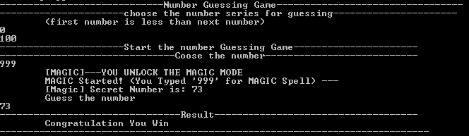

# 🎮 Number Guessing Game (C++)

A robust, logic-based CLI game where the computer generates a secret random number within a user-defined range, and the player must guess it.

## 🚀 Features
- **Dynamic Range:** Users can define their own `start` and `end` numbers.
- **Input Validation:** Prevents crashes from "Division by Zero" or invalid ranges.
- **Magic Mode:** A hidden debug feature (Code: `999`) to reveal the secret number.
- **Randomization:** Uses `srand(time(0))` to ensure a unique number in every session.

## 🛠️ Technical Concepts Used
- **Control Flow:** `if-else` branching for range validation and win/loss logic.
- **Math & Logic:** Implementation of the Range Formula:  
  `rand() % (High - Low + 1) + Low`
- **Memory Management:** Proper variable initialization and local scoping.
- **Standard Libraries:** Utilization of `<cstdlib>` for random engines and `<ctime>` for time-seeding.

## 📦 How to Run
1. Ensure you have a C++ compiler installed (like MinGW for Windows).
2. Clone this repository.
3. Compile the file:
   ```bash
   g++ main.cpp -o guessing_game

4. Run the executable:
   ```bash
    ./guessing_game.exe



## 📖 Lesson Learned
  During this project, I focused on Sequential Execution Flow. I learned that variables must be initialized with user input before performing calculations to avoid "Garbage Value" errors and runtime crashes (guessing_game.exe stopped working).
