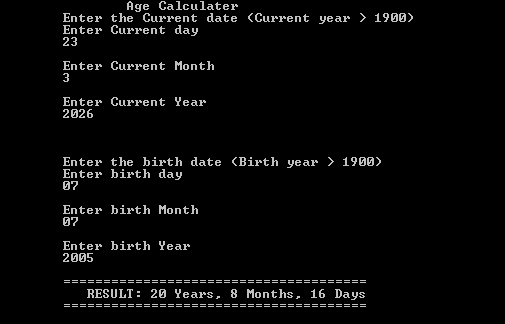

# 📅 Precise Age Calculator (C++)

A logic-driven CLI application that calculates a user's exact age in **Years, Months, and Days** by handling the complexities of the Gregorian calendar.

## 🚀 Features
- **Precise Calculation:** Uses "Borrowing Logic" to calculate exact days, months, and years.
- **Leap Year Aware:** Dynamically adjusts February to 29 days based on the year provided.
- **Input Validation:** Prevents invalid dates (e.g., Month > 12 or Day > 31) and ensures the birth year is not in the future.
- **Zero-Library Logic:** Performs all calculations using pure C++ arithmetic without external date libraries.

## 🛠️ Technical Concepts Used
- **Variable Borrowing:** Implementation of manual subtraction logic where units (Days/Months) are carried over from larger units.
- **Boolean Functions:** Use of `isLeap(int y)` to modularize the leap year check:
  ` (Year % 4 == 0 && Year % 100 != 0) || (Year % 400 == 0) `
- **Ternary Operators:** Efficiently choosing between 28 or 29 days using `condition ? true : false`.
- **Data Sanitization:** Multi-layered `if-else` blocks to catch "Garbage Input" before it reaches the calculation engine.

## 📦 How to Run
1. Ensure you have a C++ compiler (MinGW/GCC) installed.
2. Clone this repository.
3. Compile the file:
   ```bash
   g++ main.cpp -o age_calculator

4.  Run the executable:
    ```bash
     ./age_calculator.exe

## output


## 📖 Lesson Learned
    During this project, I mastered State Management in Arithmetic. I learned that "Date Subtraction" is not linear because the value of a "Month" changes depending on the calendar. I successfully implemented logic to "borrow" days from the previous month and months from the year, ensuring the program never produces negative values or "Garbage" results.