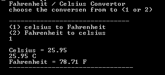
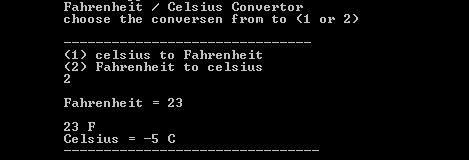

# Temperature Converter (C++)

A simple, interactive command-line tool built in C++ that converts temperatures between Celsius and Fahrenheit. This is Project #4 in my journey to build a 200-project portfolio.

## 🚀 Overview
This program allows users to input a temperature value and choose a conversion direction. It demonstrates the use of conditional logic, floating-point precision, and formatted console output.

## 🛠️ Concepts Learned
* **Control Flow:** Using `if-else` blocks to handle user decisions.
* **Data Types:** Implementing `double` for high-precision decimal calculations.
* **Input/Output (I/O):** Utilizing `cin` and `cout` with escape sequences like `\t` for a clean UI.
* **Arithmetic Logic:** Translating scientific formulas into functional code.

## 📈 The Formulas Used
* **Celsius to Fahrenheit:** $F = (C \times 1.8) + 32$
* **Fahrenheit to Celsius:** $C = (F - 32) / 1.8$

## 💻 How to Run
1. Ensure you have a C++ compiler installed (like GCC or Clang).
2. Save the code as `main.cpp`.
3. Compile the code:
   ```bash
   g++ main.cpp -o temp_converter
4.  Run the executable:
    ```bash
     ./temp_converter.exe

## output



